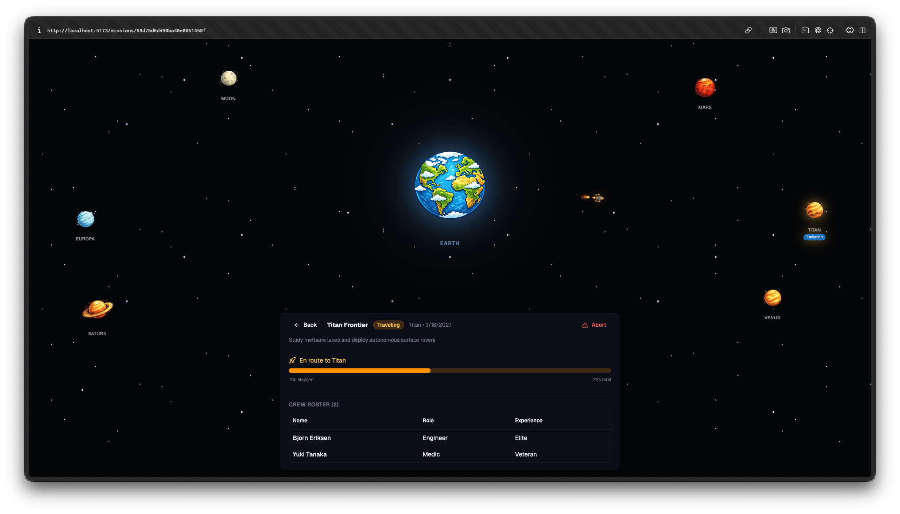

# Space Mission Control

A web-based application for planning, managing, and visually tracking space exploration missions with crew assignments.



## Features

- Plan missions to 6 destinations (Moon, Mars, Venus, Europa, Titan, Saturn)
- Assign crew members with specialized roles (Commander, Pilot, Engineer, Scientist, Medic)
- Full mission lifecycle: Planning → Countdown → Traveling → Exploring → Return → Complete
- Real-time rocket animations flying between Earth and destination planets
- Different travel and exploration times per planet
- Visual effects: launch flash, screen shake, warp speed stars, planet scanning rings
- Abort and reset missions at any time

## Tech Stack

- **Frontend:** React, Tailwind CSS, shadcn/ui, Framer Motion
- **Backend:** Node.js, Express.js
- **Database:** MongoDB (Atlas)

## Getting Started

```bash
# Backend
cd server
cp .env.example .env
# Add your MongoDB Atlas connection string to .env
npm install
npm run dev

# Frontend (separate terminal)
cd client
npm install
npm run dev
```

Open http://localhost:5173

## GitHub Repository

https://github.com/Rektoooooo/space-mission-control
